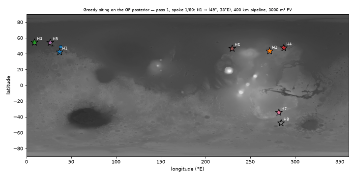

# Mars Hackathon — *Where do the solar towns go?*



*ML spoke siting in action — greedy placement of 80 spokes on a Gaussian-process surrogate of the storm Monte Carlo energy model (scenario 2, hub-supported). Colour = parent hub, size = PV array sized to the site, dashed = pipeline. Scenario 1 GIF: `outputs/scenario1_self_sufficient/spoke_selection.gif`.*

**Track: Life Support & Resource Systems — the closed loop**

A hub-and-spoke plan for a Martian city, and a **Gaussian-process surrogate that decides
where the spokes go**.

- **Hubs (8)** sit on subsurface ice (scored from the SWIM ice dataset). They mine water,
  electrolyse it to H2 + O2, and act as the comms relay for everything around them.
- **Spokes (10 per hub, 80 total)** are sited for *solar energy*. Pipelines — not rovers —
  carry water/O2 out from the hub and surplus energy/CH4 back.
- **The one decision ML drives:** given that a spoke must deliver **>= 400 kWh/sol at 95 %
  reliability** through Martian winter and dust storms, *which 80 points on the planet do
  you build on, and how big does each array need to be?* [¹]


---

## 1. Impact & Purpose — the problem this actually solves

<svg xmlns="http://www.w3.org/2000/svg" viewBox="0 0 1240 740" role="img" aria-label="Diagram of a self-sustaining Mars household: solar power splits between direct use, battery, and an electrolyser; centrally-supplied water is split into oxygen for life support and hydrogen; hydrogen is held in reserve for a fuel cell during dust storms or fed to a Sabatier reactor with Mars atmosphere CO2 to export methane; both the Sabatier reactor and the fuel cell give off water as steam, which one shared water-recovery condenser captures and recycles back into the electrolyser.">
  <defs>
    <style>
      :root{
        --paper:#EDEEF0;
        --panel:#FFFFFF;
        --ink:#1B1F22;
        --muted:#5B6266;
        --line:#B7BCC0;
        --amber:#AD731A;
        --cyan:#1C7A8C;
        --sage:#43724A;
        --rust:#AE4526;
        --font-display:'Martian Mono','IBM Plex Mono',ui-monospace,monospace;
      }
      text{ font-family: var(--font-display); }
    </style>
    <pattern id="grid" width="26" height="26" patternUnits="userSpaceOnUse">
      <circle cx="1" cy="1" r="1" fill="var(--line)" opacity="0.55"></circle>
    </pattern>
    <marker id="arrow-amber" markerWidth="9" markerHeight="9" refX="6.5" refY="3.5" orient="auto">
      <polygon points="0,0 7,3.5 0,7" fill="var(--amber)"></polygon>
    </marker>
    <marker id="arrow-cyan" markerWidth="9" markerHeight="9" refX="6.5" refY="3.5" orient="auto">
      <polygon points="0,0 7,3.5 0,7" fill="var(--cyan)"></polygon>
    </marker>
    <marker id="arrow-sage" markerWidth="9" markerHeight="9" refX="6.5" refY="3.5" orient="auto">
      <polygon points="0,0 7,3.5 0,7" fill="var(--sage)"></polygon>
    </marker>
    <marker id="arrow-rust" markerWidth="9" markerHeight="9" refX="6.5" refY="3.5" orient="auto">
      <polygon points="0,0 7,3.5 0,7" fill="var(--rust)"></polygon>
    </marker>
  </defs>

  <rect x="0" y="0" width="1240" height="740" fill="var(--paper)"></rect>
  <rect x="0" y="0" width="1240" height="740" fill="url(#grid)"></rect>

  <!-- household envelope -->
  <rect x="240" y="75" width="730" height="610" rx="20" fill="none" stroke="var(--line)" stroke-width="1.5"></rect>
  <text x="260" y="100" font-size="11" font-weight="600" letter-spacing="0.08em" fill="var(--muted)">ONE HOUSEHOLD UNIT</text>
  <text x="260" y="115" font-size="9.5" fill="var(--muted)">replicated per family across the settlement</text>

  <!-- sun icon + sunlight arrow -->
  <circle cx="55" cy="30" r="9" fill="none" stroke="var(--amber)" stroke-width="1.6"></circle>
  <g stroke="var(--amber)" stroke-width="1.6">
    <line x1="55" y1="12" x2="55" y2="6"></line>
    <line x1="55" y1="48" x2="55" y2="54"></line>
    <line x1="37" y1="30" x2="31" y2="30"></line>
    <line x1="73" y1="30" x2="79" y2="30"></line>
    <line x1="42" y1="17" x2="38" y2="13"></line>
    <line x1="68" y1="17" x2="72" y2="13"></line>
  </g>
  <line x1="66" y1="40" x2="372" y2="107" stroke="var(--amber)" stroke-width="2" marker-end="url(#arrow-amber)"></line>
  <text x="150" y="70" font-size="11" fill="var(--amber)">sunlight</text>

  <!-- PV array -->
  <rect x="290" y="110" width="170" height="70" rx="10" fill="var(--panel)" stroke="var(--line)" stroke-width="1.5"></rect>
  <text x="375" y="139" text-anchor="middle" font-size="13" font-weight="600" fill="var(--ink)">SOLAR PV ARRAY</text>
  <text x="375" y="157" text-anchor="middle" font-size="10" fill="var(--muted)">runs every sol</text>

  <!-- bus dot + fan out -->
  <line x1="375" y1="180" x2="375" y2="215" stroke="var(--amber)" stroke-width="2"></line>
  <circle cx="375" cy="215" r="4" fill="var(--amber)"></circle>
  <text x="375" y="200" text-anchor="middle" font-size="9.5" fill="var(--amber)">solar bus</text>

  <line x1="375" y1="215" x2="375" y2="246" stroke="var(--amber)" stroke-width="2" marker-end="url(#arrow-amber)"></line>

  <polyline points="375,215 605,215 605,296" fill="none" stroke="var(--amber)" stroke-width="2" marker-end="url(#arrow-amber)"></polyline>
  <text x="470" y="209" text-anchor="middle" font-size="10.5" fill="var(--amber)">surplus power</text>

  <polyline points="375,215 265,215 265,565 286,565" fill="none" stroke="var(--amber)" stroke-width="2" marker-end="url(#arrow-amber)"></polyline>
  <text x="222" y="390" text-anchor="middle" font-size="10.5" fill="var(--amber)" transform="rotate(-90 222 390)">electricity, direct</text>

  <!-- Battery -->
  <rect x="290" y="250" width="170" height="70" rx="10" fill="var(--panel)" stroke="var(--line)" stroke-width="1.5"></rect>
  <text x="375" y="279" text-anchor="middle" font-size="13" font-weight="600" fill="var(--ink)">BATTERY</text>
  <text x="375" y="297" text-anchor="middle" font-size="10" fill="var(--muted)">daily charge / discharge</text>

  <line x1="375" y1="320" x2="375" y2="516" stroke="var(--amber)" stroke-width="2" marker-end="url(#arrow-amber)"></line>
  <text x="386" y="430" font-size="10.5" fill="var(--amber)">discharge &#183; night</text>

  <!-- Household loads -->
  <rect x="290" y="520" width="170" height="90" rx="10" fill="var(--panel)" stroke="var(--line)" stroke-width="1.5"></rect>
  <text x="375" y="555" text-anchor="middle" font-size="13" font-weight="600" fill="var(--ink)">HOUSEHOLD LOADS</text>
  <text x="375" y="573" text-anchor="middle" font-size="10" fill="var(--muted)">heat &#183; hot water</text>
  <text x="375" y="588" text-anchor="middle" font-size="10" fill="var(--muted)">lighting &#183; general</text>

  <!-- Electrolyser -->
  <rect x="520" y="300" width="170" height="80" rx="10" fill="var(--panel)" stroke="var(--line)" stroke-width="1.5"></rect>
  <text x="605" y="333" text-anchor="middle" font-size="13" font-weight="600" fill="var(--ink)">ELECTROLYSER</text>
  <text x="605" y="351" text-anchor="middle" font-size="10" fill="var(--muted)">splits water &#8594; O&#8322; + H&#8322;</text>

  <!-- Water utility -->
  <rect x="20" y="380" width="190" height="90" rx="10" fill="var(--panel)" stroke="var(--line)" stroke-width="1.5" stroke-dasharray="6 5"></rect>
  <text x="115" y="415" text-anchor="middle" font-size="12" font-weight="600" fill="var(--ink)">CENTRALIZED</text>
  <text x="115" y="430" text-anchor="middle" font-size="12" font-weight="600" fill="var(--ink)">WATER UTILITY</text>
  <text x="115" y="448" text-anchor="middle" font-size="9.5" fill="var(--muted)">ice excavation &#183; shared, not per house</text>

  <polyline points="210,425 470,425 470,340 520,340" fill="none" stroke="var(--cyan)" stroke-width="2" marker-end="url(#arrow-cyan)"></polyline>
  <text x="345" y="415" text-anchor="middle" font-size="10.5" fill="var(--cyan)">water</text>

  <!-- Electrolyser -> Life support -->
  <polyline points="690,332 725,332 725,235 758,235" fill="none" stroke="var(--sage)" stroke-width="2" marker-end="url(#arrow-sage)"></polyline>
  <text x="734" y="285" text-anchor="middle" font-size="10.5" fill="var(--sage)" transform="rotate(-90 734 285)">O&#8322;</text>

  <!-- Life support -->
  <rect x="760" y="200" width="180" height="70" rx="10" fill="var(--panel)" stroke="var(--line)" stroke-width="1.5"></rect>
  <text x="850" y="229" text-anchor="middle" font-size="13" font-weight="600" fill="var(--ink)">LIFE SUPPORT</text>
  <text x="850" y="247" text-anchor="middle" font-size="10" fill="var(--muted)">breathable air, in-house</text>

  <!-- Electrolyser -> H2 tank -->
  <line x1="605" y1="380" x2="605" y2="416" stroke="var(--rust)" stroke-width="2" marker-end="url(#arrow-rust)"></line>
  <text x="617" y="404" font-size="10" fill="var(--rust)">H&#8322;</text>

  <!-- H2 tank -->
  <rect x="520" y="420" width="170" height="70" rx="10" fill="var(--panel)" stroke="var(--line)" stroke-width="1.5" stroke-dasharray="6 5"></rect>
  <text x="605" y="449" text-anchor="middle" font-size="13" font-weight="600" fill="var(--ink)">H&#8322; STORAGE</text>
  <text x="605" y="467" text-anchor="middle" font-size="10" fill="var(--muted)">standby reserve</text>

  <!-- H2 tank -> Fuel cell -->
  <line x1="605" y1="490" x2="605" y2="546" stroke="var(--rust)" stroke-width="2" marker-end="url(#arrow-rust)"></line>
  <text x="617" y="522" font-size="10" fill="var(--rust)">H&#8322;, storm draw</text>

  <!-- Fuel cell -->
  <rect x="520" y="550" width="170" height="70" rx="10" fill="var(--panel)" stroke="var(--line)" stroke-width="1.5" stroke-dasharray="6 5"></rect>
  <text x="605" y="579" text-anchor="middle" font-size="13" font-weight="600" fill="var(--ink)">FUEL CELL</text>
  <text x="605" y="597" text-anchor="middle" font-size="10" fill="var(--muted)">dust-storm backup only</text>

  <!-- Fuel cell -> household loads -->
  <line x1="520" y1="585" x2="464" y2="585" stroke="var(--amber)" stroke-width="2" marker-end="url(#arrow-amber)"></line>
  <text x="495" y="576" text-anchor="middle" font-size="9.5" fill="var(--amber)">storm backup</text>

  <!-- H2 tank -> Sabatier -->
  <line x1="690" y1="455" x2="756" y2="455" stroke="var(--rust)" stroke-width="2" marker-end="url(#arrow-rust)"></line>
  <text x="723" y="446" text-anchor="middle" font-size="9.5" fill="var(--rust)">H&#8322; feedstock</text>

  <!-- Sabatier -->
  <rect x="760" y="415" width="180" height="80" rx="10" fill="var(--panel)" stroke="var(--line)" stroke-width="1.5"></rect>
  <text x="850" y="448" text-anchor="middle" font-size="13" font-weight="600" fill="var(--ink)">SABATIER REACTOR</text>
  <text x="850" y="466" text-anchor="middle" font-size="10" fill="var(--muted)">CO&#8322; + H&#8322; &#8594; fuel + water</text>

  <!-- Sabatier -> Water Recovery (steam) -->
  <line x1="810" y1="495" x2="810" y2="546" stroke="var(--cyan)" stroke-width="2" marker-end="url(#arrow-cyan)"></line>
  <text x="822" y="525" font-size="9.5" fill="var(--cyan)">H&#8322;O vapor</text>

  <!-- Fuel cell -> Water Recovery (steam) -->
  <line x1="690" y1="585" x2="756" y2="585" stroke="var(--cyan)" stroke-width="2" marker-end="url(#arrow-cyan)"></line>
  <text x="723" y="577" text-anchor="middle" font-size="9" fill="var(--cyan)">H&#8322;O vapor (steam)</text>

  <!-- Water Recovery -->
  <rect x="760" y="550" width="180" height="70" rx="10" fill="var(--panel)" stroke="var(--line)" stroke-width="1.5"></rect>
  <text x="850" y="578" text-anchor="middle" font-size="13" font-weight="600" fill="var(--ink)">WATER RECOVERY</text>
  <text x="850" y="596" text-anchor="middle" font-size="9.5" fill="var(--muted)">shared condenser, both steams</text>

  <!-- Water Recovery -> Electrolyser (recycled) -->
  <polyline points="850,620 850,655 498,655 498,365 520,365" fill="none" stroke="var(--cyan)" stroke-width="2" marker-end="url(#arrow-cyan)"></polyline>
  <text x="674" y="648" text-anchor="middle" font-size="10" fill="var(--cyan)">H&#8322;O recycled</text>

  <!-- Mars atmosphere -->
  <rect x="1010" y="260" width="200" height="70" rx="10" fill="var(--panel)" stroke="var(--line)" stroke-width="1.5" stroke-dasharray="6 5"></rect>
  <text x="1110" y="289" text-anchor="middle" font-size="13" font-weight="600" fill="var(--ink)">MARS ATMOSPHERE</text>
  <text x="1110" y="307" text-anchor="middle" font-size="10" fill="var(--muted)">thin CO&#8322; air, free input</text>

  <polyline points="1010,295 970,295 970,435 942,435" fill="none" stroke="var(--rust)" stroke-width="2" marker-end="url(#arrow-rust)"></polyline>
  <text x="979" y="365" text-anchor="middle" font-size="10.5" fill="var(--rust)" transform="rotate(-90 979 365)">CO&#8322;</text>

  <!-- Sabatier -> Methane export -->
  <line x1="940" y1="475" x2="1006" y2="475" stroke="var(--rust)" stroke-width="2" marker-end="url(#arrow-rust)"></line>
  <text x="973" y="466" text-anchor="middle" font-size="9.5" fill="var(--rust)">CH&#8324;, export</text>

  <!-- Methane export / community depot -->
  <rect x="1010" y="430" width="200" height="90" rx="10" fill="var(--panel)" stroke="var(--line)" stroke-width="1.5" stroke-dasharray="6 5"></rect>
  <text x="1110" y="465" text-anchor="middle" font-size="12.5" font-weight="600" fill="var(--ink)">COMMUNITY</text>
  <text x="1110" y="481" text-anchor="middle" font-size="12.5" font-weight="600" fill="var(--ink)">FUEL DEPOT</text>
  <text x="1110" y="499" text-anchor="middle" font-size="9.5" fill="var(--muted)">methane leaves the household</text>
</svg>

A first settlement does not get to guess where its power comes from. Ice fixes where the
hubs go: the SWIM-scored sites are at 42–54° N, which is exactly where sunlight gets
marginal in winter. So the settlement's first real planning question is the trade between
**being near your water** and **being where the sun is** — and every kilometre of that
trade costs pipeline, panel mass, and lives if you get it wrong.

We answer it quantitatively, with a feasibility bar (400 kWh/sol at 95 % reliability) that
comes from an actual household energy balance, not a vibe. The headline result is a
planning finding, not a demo:

| | Scenario 1 — self-sufficient spokes | Scenario 2 — hub-supported spokes |
|---|---|---|
| array cap per spoke | 7 500 m² | 15 000 m² |
| energy piped from hub | none | 200 kWh/sol (hub H2) |
| **feasibility ends at** | **\|lat\| ≈ 55°** | **\|lat\| ≈ 84°** |
| mean array sized | 3 400 m² | 3 400 m² |
| mean pipeline run | 1 585 km | 1 606 km |

**Solar-only spokes cannot survive a polar winter at 95 % reliability.** Feasibility dies
right at the latitude of the ice hubs themselves — which is precisely *why* the hubs make
hydrogen. Let a hub pipe back 200 kWh/sol and the habitable band opens to 84°, i.e. the
whole reachable planet. That is the argument for the two-tier city in one number.

## 2. Innovation & Creativity — a GP over a simulator, not over a dataset

Everyone fits a model to data they already have. We do the opposite: we fit a GP to a
**simulator that is too expensive to run everywhere**, which is the situation a real
settlement is actually in.

Evaluating one candidate site means running, end to end:

1. a physics solar model — Mars orbit (e = 0.0934, obliquity 25.19°, Ls), daily-integrated
   cos(zenith), Beer–Lambert with background dust τ ~ U(0.3, 1.0) drawn per storm-year and
   pressure-scaled by MOLA elevation → a 668-sol insolation profile;
2. a **1D transient regolith + habitat thermal model** (explicit finite difference, a full
   Mars year of diurnal forcing, CO2 frost clamp) → the sol-by-sol *heating load*;
3. the team's `household_sizing.py` sol-by-sol energy balance driven by that insolation
   minus heating, through **40 Monte Carlo dust-storm years**, inside a bisection on demand.

~1 s per site. The 0.5° candidate grid inside the hubs' reach is **272 000 points** — about
75 hours of simulation; the planet at MOLA resolution is weeks. So we evaluate a **sparse design of 80 sites** (8 per hub = 64, plus 2 active-learning
rounds of 8), fit a GP over (lat, lon, elevation) with an ARD Matérn kernel, and optimise on
the *posterior* — which then scores all **272 000** candidate points for free.

The uncertainty then does two jobs no point-estimate model can do:

- **Risk-aware siting.** The 400 kWh/sol constraint is applied to the 95 % *lower confidence
  bound*, not the mean. A site is only built on if it clears the bar even when the surrogate
  is wrong in the bad direction.
- **Active survey planning.** An active-learning loop spends the next expensive evaluations
  where the posterior is uncertain **near the 400 kWh/sol decision boundary** — the same
  loop a real programme would use to decide where to send the next survey lander.

**Arrays are sized per site, not per design.** PV output scales with area but heating load
does not, so with a second GP over mean heating load `h`:

```
required_area = 3000 m² · (400 − import + h) / (LCB95(capacity at 3000 m²) + h)
```

Sites needing more than the scenario's cap are infeasible. Both scenarios reuse **one GP** —
a constant per-sol import is exactly a demand reduction, so the expensive physics is paid
for once.

## 3. Technical Execution — what runs

```bash
uv venv .venv && uv pip install -p .venv/bin/python numpy scipy matplotlib scikit-learn optuna
.venv/bin/python -m spoke_siting.run        # ~2 min end to end
.venv/bin/python -m spoke_siting.run --fast # ~20 s smoke test
```

Everything in `outputs/` was produced by that command at default settings — 80 expensive
evaluations, both scenarios, ~2 min. Individual models self-test:
`python -m spoke_siting.site_energy`, `python spoke_siting/thermal_site.py`
(→ `spoke_siting/thermal_validation.png`), `python household_sizing.py`.

Siting is a **weighted, constrained p-median** solved greedily, round-robin across hubs
(one spoke per hub per pass, so no hub is starved) on a 0.5° candidate grid:

```
score = − 200 · (extra panel area / 3000 m²)      # panel cost
        − 0.05 · pipeline km                      # pipeline cost
        − 300 · Σ_j exp(−(d_j / 700 km)²)         # coverage: planetary-scale dispersion
s.t.  required area ≤ cap,  |elevation| ≤ 5 km,  spacing ≥ 150 km,
      400 km ≤ distance to hub ≤ 2500 km
```

The three weights are the explicit, user-set knobs of the p-median framing. The coverage
term is what stops all 80 spokes piling onto the sunniest latitude band: it buys a few
poleward, bigger-array sites instead. Result: **80/80 spokes feasible in both scenarios.**

**Outputs**

| file | what it shows |
|---|---|
| `outputs/scenario_overlay.png` | both layouts on one map — the headline slide |
| `outputs/scenario{1,2}_*/spoke_map.png` | chosen spokes coloured by parent hub, dashed pipelines |
| `outputs/scenario{1,2}_*/hub_panels.png` | per-hub detail: posterior mean, uncertainty, chosen sites |
| `outputs/scenario{1,2}_*/spokes.csv` | 80 rows: lat, lon, elev, pipeline km, capacity mean/std/LCB, sized array |
| `outputs/gp_training_sites.csv` | the 80 expensive evaluations the GP was actually trained on |

**Code**

| file | role |
|---|---|
| `household_sizing.py` | sol-by-sol household energy balance + Optuna sizing search (teammate's model) |
| `spoke_siting/solar_site.py` | per-site 668-sol insolation profile |
| `spoke_siting/thermal_site.py` | 1D regolith/habitat FD thermal model → heating load per sol |
| `spoke_siting/site_energy.py` | the expensive f(x): capacity at 95 % reliability for a site |
| `spoke_siting/mola.py` | MOLA MEGDR 4 px/deg elevation (real PDS raster) |
| `spoke_siting/gp_surrogate.py` | site sampling, GP fit, candidate grids |
| `spoke_siting/optimize_spokes.py` | greedy constrained p-median selection on the posterior |
| `spoke_siting/run.py` | driver: sample → evaluate → GP → active learning → select → figures |

## 4. Feasibility & Real-World Potential — the path out of the prototype

The architecture is deliberately swap-in-place; nothing here is a toy that has to be
rewritten to become real:

- **The surrogate loop is the deployment.** Replace `site_energy.capacity_kwh_per_sol` with
  a high-fidelity plant model, or with *telemetry from spokes already built*, and the same
  GP + active-learning loop keeps siting the next ones. The posterior variance becomes a
  survey plan: where to send the next lander.
- **Real data already in the loop.** MOLA MEGDR elevation from the PDS drives both the
  pressure-scaled optical depth and the elevation-safety cutoff; hub locations come from
  SWIM ice scoring.
- **Longitude is already an input**, so a dust-climatology or thermal-inertia raster slots
  into the GP with zero code change — the current stand-in physics just happens to be
  longitude-independent.
- **The two scenarios are a procurement decision, not a graph.** Scenario 2 says: build the
  hub H2 chain first, and the same panel budget reaches 84° instead of 55°.

## 5. Honest caveats

We would rather be judged on what we know is soft than have you find it:

- The solar and thermal models are ours, with labelled assumptions (diffuse fraction,
  habitat U-value, 20 W/m² downwelling IR). Dust storms enter via the team's storm Monte
  Carlo, not the thermal model.
- In the current stand-in, capacity depends on latitude and elevation only, so the GP field
  is smooth and the surrogate has an easier job than it would on real terrain.
- Spoke storage is fixed at 1 000 kWh battery + 4 000 kWh H2 (mid-range of the Optuna search
  space); only the PV array is sized per site.
- Greedy selection is not globally optimal; it is the right call for an evening, and the
  objective is written so a MILP or local search drops straight in.

## 6. Team & Collaboration

Split across the physics, the ML, and the city plan, integrating on one shared interface —
`capacity_kwh_per_sol(site) -> kWh/sol at 95 % reliability`:

- **Hub siting & city architecture** — SWIM ice scoring, the two-tier hub/spoke concept,
  pipelines-over-rovers, comms relay framing.
- **Household energy model** (`household_sizing.py`) — sol-by-sol balance, storm Monte
  Carlo, Optuna sizing, life-support water/O2 budget.
- **ML spoke siting** (`spoke_siting/`) — solar + thermal site models, GP surrogate, active
  learning, constrained p-median optimiser, maps.

The interface was agreed before either side was written, which is why the expensive energy
model dropped into the GP loop unchanged.

---
[¹] The 400 kWh/sol, 95%-reliability bar comes from Rucker, M. A., "Surface Power for Mars," Mars Study Capability Team, NASA Johnson Space Center — NASA DRA 5.0 (NTRS Document ID 20160014032, JSC-CN-37990, Dec. 2016): a 4-person crew's combined surface habitat (8.0 kW) + Mars Ascent Vehicle (6.655 kW) keep-alive load, ≈14.9 kW → 357.6 kWh/day, rounded up to 400 kWh/sol to also cover this design's on-site electrolysis/Sabatier load. Full derivation and citation in design_calculations.md (§1, §11).
*Deeper method notes: [`spoke_siting/README.md`](spoke_siting/README.md). Scope and
timeline: [`PLAN.md`](PLAN.md).*
