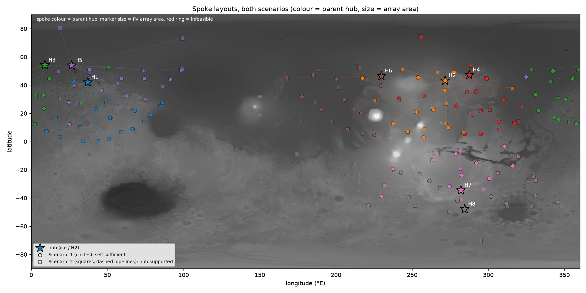

# Mars Hackathon — *Where do the solar towns go?*

**Track: Life Support & Resource Systems — the closed loop**

A hub-and-spoke plan for a Martian city, and a **Gaussian-process surrogate that decides
where the spokes go**.

- **Hubs (8)** sit on subsurface ice (scored from the SWIM ice dataset). They mine water,
  electrolyse it to H2 + O2, and act as the comms relay for everything around them.
- **Spokes (10 per hub, 80 total)** are sited for *solar energy*. Pipelines — not rovers —
  carry water/O2 out from the hub and surplus energy/CH4 back.
- **The one decision ML drives:** given that a spoke must deliver **>= 400 kWh/sol at 95 %
  reliability** through Martian winter and dust storms, *which 80 points on the planet do
  you build on, and how big does each array need to be?*



---

## 1. Impact & Purpose — the problem this actually solves

A first settlement does not get to guess where its power comes from. Ice fixes where the
hubs go: the SWIM-scored sites are at 42–54° N, which is exactly where sunlight gets
marginal in winter. So the settlement's first real planning question is the trade between
**being near your water** and **being where the sun is** — and every kilometre of that
trade costs pipeline, panel mass, and lives if you get it wrong.

We answer it quantitatively, with a feasibility bar (400 kWh/sol at 95 % reliability) that
comes from an actual household energy balance, not a vibe. The headline result is a
planning finding, not a demo:

| | Scenario 1 — self-sufficient spokes | Scenario 2 — hub-supported spokes |
|---|---|---|
| array cap per spoke | 7 500 m² | 15 000 m² |
| energy piped from hub | none | 200 kWh/sol (hub H2) |
| **feasibility ends at** | **\|lat\| ≈ 55°** | **\|lat\| ≈ 84°** |
| mean array sized | 3 400 m² | 3 400 m² |
| mean pipeline run | 1 585 km | 1 606 km |

**Solar-only spokes cannot survive a polar winter at 95 % reliability.** Feasibility dies
right at the latitude of the ice hubs themselves — which is precisely *why* the hubs make
hydrogen. Let a hub pipe back 200 kWh/sol and the habitable band opens to 84°, i.e. the
whole reachable planet. That is the argument for the two-tier city in one number.

## 2. Innovation & Creativity — a GP over a simulator, not over a dataset

Everyone fits a model to data they already have. We do the opposite: we fit a GP to a
**simulator that is too expensive to run everywhere**, which is the situation a real
settlement is actually in.

Evaluating one candidate site means running, end to end:

1. a physics solar model — Mars orbit (e = 0.0934, obliquity 25.19°, Ls), daily-integrated
   cos(zenith), Beer–Lambert with background dust τ ~ U(0.3, 1.0) drawn per storm-year and
   pressure-scaled by MOLA elevation → a 668-sol insolation profile;
2. a **1D transient regolith + habitat thermal model** (explicit finite difference, a full
   Mars year of diurnal forcing, CO2 frost clamp) → the sol-by-sol *heating load*;
3. the team's `household_sizing.py` sol-by-sol energy balance driven by that insolation
   minus heating, through **40 Monte Carlo dust-storm years**, inside a bisection on demand.

~1 s per site. The 0.5° candidate grid inside the hubs' reach is **272 000 points** — about
75 hours of simulation; the planet at MOLA resolution is weeks. So we evaluate a **sparse design of 80 sites** (8 per hub = 64, plus 2 active-learning
rounds of 8), fit a GP over (lat, lon, elevation) with an ARD Matérn kernel, and optimise on
the *posterior* — which then scores all **272 000** candidate points for free.

The uncertainty then does two jobs no point-estimate model can do:

- **Risk-aware siting.** The 400 kWh/sol constraint is applied to the 95 % *lower confidence
  bound*, not the mean. A site is only built on if it clears the bar even when the surrogate
  is wrong in the bad direction.
- **Active survey planning.** An active-learning loop spends the next expensive evaluations
  where the posterior is uncertain **near the 400 kWh/sol decision boundary** — the same
  loop a real programme would use to decide where to send the next survey lander.

**Arrays are sized per site, not per design.** PV output scales with area but heating load
does not, so with a second GP over mean heating load `h`:

```
required_area = 3000 m² · (400 − import + h) / (LCB95(capacity at 3000 m²) + h)
```

Sites needing more than the scenario's cap are infeasible. Both scenarios reuse **one GP** —
a constant per-sol import is exactly a demand reduction, so the expensive physics is paid
for once.

## 3. Technical Execution — what runs

```bash
uv venv .venv && uv pip install -p .venv/bin/python numpy scipy matplotlib scikit-learn optuna
.venv/bin/python -m spoke_siting.run        # ~2 min end to end
.venv/bin/python -m spoke_siting.run --fast # ~20 s smoke test
```

Everything in `outputs/` was produced by that command at default settings — 80 expensive
evaluations, both scenarios, ~2 min. Individual models self-test:
`python -m spoke_siting.site_energy`, `python spoke_siting/thermal_site.py`
(→ `spoke_siting/thermal_validation.png`), `python household_sizing.py`.

Siting is a **weighted, constrained p-median** solved greedily, round-robin across hubs
(one spoke per hub per pass, so no hub is starved) on a 0.5° candidate grid:

```
score = − 200 · (extra panel area / 3000 m²)      # panel cost
        − 0.05 · pipeline km                      # pipeline cost
        − 300 · Σ_j exp(−(d_j / 700 km)²)         # coverage: planetary-scale dispersion
s.t.  required area ≤ cap,  |elevation| ≤ 5 km,  spacing ≥ 150 km,
      400 km ≤ distance to hub ≤ 2500 km
```

The three weights are the explicit, user-set knobs of the p-median framing. The coverage
term is what stops all 80 spokes piling onto the sunniest latitude band: it buys a few
poleward, bigger-array sites instead. Result: **80/80 spokes feasible in both scenarios.**

**Outputs**

| file | what it shows |
|---|---|
| `outputs/scenario_overlay.png` | both layouts on one map — the headline slide |
| `outputs/scenario{1,2}_*/spoke_map.png` | chosen spokes coloured by parent hub, dashed pipelines |
| `outputs/scenario{1,2}_*/hub_panels.png` | per-hub detail: posterior mean, uncertainty, chosen sites |
| `outputs/scenario{1,2}_*/spokes.csv` | 80 rows: lat, lon, elev, pipeline km, capacity mean/std/LCB, sized array |
| `outputs/gp_training_sites.csv` | the 80 expensive evaluations the GP was actually trained on |

**Code**

| file | role |
|---|---|
| `household_sizing.py` | sol-by-sol household energy balance + Optuna sizing search (teammate's model) |
| `spoke_siting/solar_site.py` | per-site 668-sol insolation profile |
| `spoke_siting/thermal_site.py` | 1D regolith/habitat FD thermal model → heating load per sol |
| `spoke_siting/site_energy.py` | the expensive f(x): capacity at 95 % reliability for a site |
| `spoke_siting/mola.py` | MOLA MEGDR 4 px/deg elevation (real PDS raster) |
| `spoke_siting/gp_surrogate.py` | site sampling, GP fit, candidate grids |
| `spoke_siting/optimize_spokes.py` | greedy constrained p-median selection on the posterior |
| `spoke_siting/run.py` | driver: sample → evaluate → GP → active learning → select → figures |

## 4. Feasibility & Real-World Potential — the path out of the prototype

The architecture is deliberately swap-in-place; nothing here is a toy that has to be
rewritten to become real:

- **The surrogate loop is the deployment.** Replace `site_energy.capacity_kwh_per_sol` with
  a high-fidelity plant model, or with *telemetry from spokes already built*, and the same
  GP + active-learning loop keeps siting the next ones. The posterior variance becomes a
  survey plan: where to send the next lander.
- **Real data already in the loop.** MOLA MEGDR elevation from the PDS drives both the
  pressure-scaled optical depth and the elevation-safety cutoff; hub locations come from
  SWIM ice scoring.
- **Longitude is already an input**, so a dust-climatology or thermal-inertia raster slots
  into the GP with zero code change — the current stand-in physics just happens to be
  longitude-independent.
- **The two scenarios are a procurement decision, not a graph.** Scenario 2 says: build the
  hub H2 chain first, and the same panel budget reaches 84° instead of 55°.

## 5. Honest caveats

We would rather be judged on what we know is soft than have you find it:

- The solar and thermal models are ours, with labelled assumptions (diffuse fraction,
  habitat U-value, 20 W/m² downwelling IR). Dust storms enter via the team's storm Monte
  Carlo, not the thermal model.
- In the current stand-in, capacity depends on latitude and elevation only, so the GP field
  is smooth and the surrogate has an easier job than it would on real terrain.
- Spoke storage is fixed at 1 000 kWh battery + 4 000 kWh H2 (mid-range of the Optuna search
  space); only the PV array is sized per site.
- Greedy selection is not globally optimal; it is the right call for an evening, and the
  objective is written so a MILP or local search drops straight in.

## 6. Team & Collaboration

Split across the physics, the ML, and the city plan, integrating on one shared interface —
`capacity_kwh_per_sol(site) -> kWh/sol at 95 % reliability`:

- **Hub siting & city architecture** — SWIM ice scoring, the two-tier hub/spoke concept,
  pipelines-over-rovers, comms relay framing.
- **Household energy model** (`household_sizing.py`) — sol-by-sol balance, storm Monte
  Carlo, Optuna sizing, life-support water/O2 budget.
- **ML spoke siting** (`spoke_siting/`) — solar + thermal site models, GP surrogate, active
  learning, constrained p-median optimiser, maps.

The interface was agreed before either side was written, which is why the expensive energy
model dropped into the GP loop unchanged.

---

*Deeper method notes: [`spoke_siting/README.md`](spoke_siting/README.md). Scope and
timeline: [`PLAN.md`](PLAN.md).*
